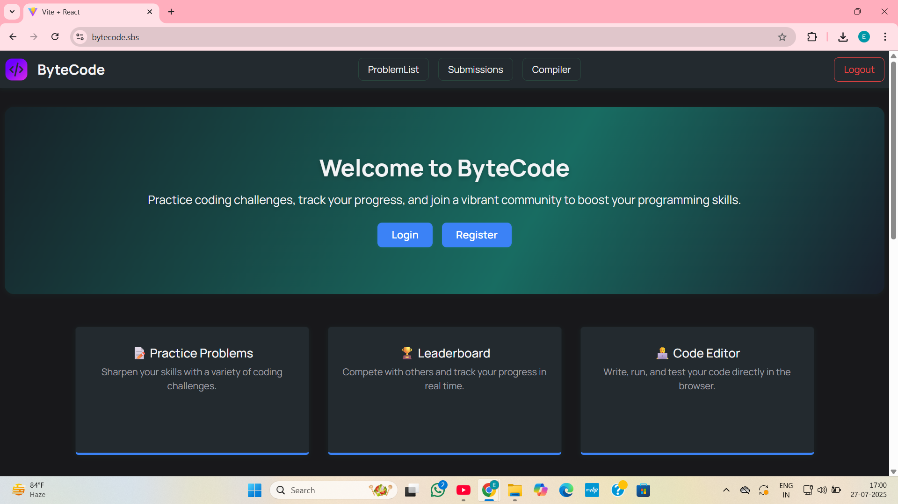
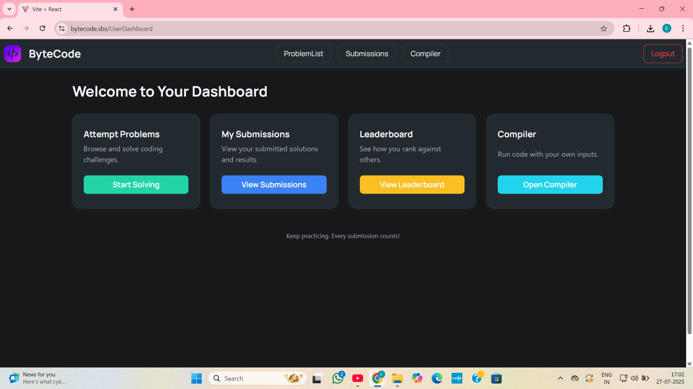
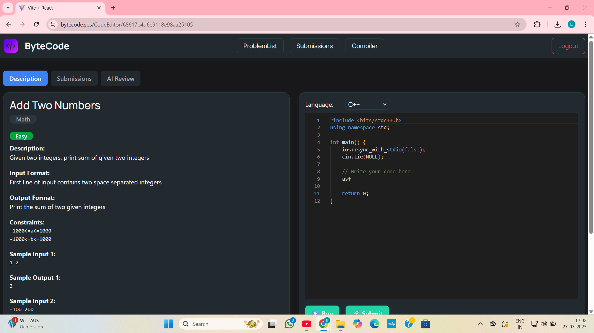

# 🏆 OJ-Project - Online Judge Platform

A comprehensive online judge platform for coding competitions and practice, featuring real-time code compilation, submission tracking, and AI-powered assistance.

## 🌟 Features

- **Interactive Code Editor** with multi-language support (C++, Java, Python)
- **Real-time Code Compilation** with instant feedback and custom test cases
- **Problem Management** with categories, difficulty levels, and automated evaluation
- **User Authentication** with role-based access control and submission tracking
- **Leaderboard & Analytics** with performance metrics and statistics
- **AI-powered Assistance** with intelligent hints and code analysis

## 📸 Screenshots

### Home Page


### Dashboard


### Code Editor



## 🛠️ Tech Stack

### **Frontend**
- **React 19** with modern hooks
- **Vite** for fast development and building
- **React Router** for navigation
- **TailwindCSS** + **Bootstrap** for styling
- **Monaco Editor** & **CodeMirror** for code editing
- **Axios** for API communication

### **Backend**
- **Node.js** with **Express.js**
- **MongoDB** with **Mongoose** ODM
- **JWT Authentication** with **bcryptjs**
- **Google GenAI** integration
- **CORS** enabled for cross-origin requests

### **Code Compiler Service**
- **Dockerized compilation environment**
- **Multi-language code execution**
- **Secure sandboxed execution**
- **Real-time compilation results**

### **DevOps & Deployment**
- **Docker & Docker Compose** for containerization
- **Vercel** deployment ready
- **Development & Production** configurations

## 🚀 Getting Started

### Prerequisites
- **Node.js** (v18 or higher)
- **MongoDB** (local or cloud)
- **Docker** & **Docker Compose** (for compiler service)
- **Git**

### 🔧 Installation

1. **Clone the repository**
```bash
git clone https://github.com/swarooperla/OJ-Project.git
cd OJ-Project
```

2. **Install root dependencies**
```bash
npm install
```

3. **Setup Client (Frontend)**
```bash
cd client
npm install
# or
pnpm install
```

4. **Setup Server (Backend)**
```bash
cd ../server
npm install
# or 
pnpm install
```

5. **Setup Compiler Service**
```bash
cd ../compiler
npm install
# or
pnpm install
```

### 💻 Development Setup

1. **Start Backend Server**
```bash
cd server
npm run dev
# Server runs on http://localhost:8000
```

2. **Start Compiler Service**
```bash
cd compiler
npm run dev
# Compiler runs on http://localhost:9000
```

3. **Start Frontend**
```bash
cd client
npm run dev
# Frontend runs on http://localhost:5173
```

## 🚀 Deployment

### Frontend (Vercel)
The frontend is configured for Vercel deployment with `vercel.json`.

### Backend
Deploy to any Node.js hosting service (Heroku, AWS, DigitalOcean, etc.)

### Compiler Service
Deploy using Docker to any container hosting service.

## 📝 License

This project is licensed under the MIT License - see the [LICENSE](LICENSE) file for details.

## 👨‍💻 Authors

- **Erla Gnana Swaroop** - [GitHub](https://github.com/swarooperla)

---

**Happy Coding!** 🎉
